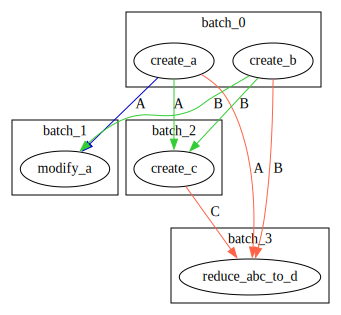

# dagga 🌿
A crate for scheduling directed acyclic graphs.

## Features

- node `creates` resources semantics
- node `reads` resource semantics, ie borrow
- `writes` resource semantics, ie mutable/exclusive borrow
- `consumes` resource semantics, ie move
- node dependencies
  * node X must run _before_ node Y
  * node X must run _after_ node Y
  * barriers - nodes added before a barrier will always be scheduled before the barrier and nodes added after a barrier will always be scheduled after the barrier

## Example uses
* scheduling parallel operations with dependencies, shared and exclusive resources
* scheduling steps in a render graph
* scheduling system batches in ECS

## Example

```rust
use dagga::*;

let mut dag = Dag::default();

// Create names for our resources.
//
// These represent the types of the resources that get created, read, modified and
// consumed by each node.
let [a, b, c, d]: [usize; 4] = [0, 1, 2, 3];

// Add the nodes with their dependencies and build the schedule.
let schedule = dag
    .with_node(
        // This node results in the creation of an `a`.
        Node::default()
            .with_name("create-a")
            .with_result(a)
    )
    .with_node(
        // This node consumes `a`, `b`, `c` and results in `d`.
        Node::default()
            .with_name("reduce-abc-to-d")
            .with_move(a)
            .with_move(b)
            .with_move(c)
            .with_result(d)
    )
    .with_node(
        // This node reads `a` and `b` and results in `c`
        Node::default()
            .with_name("create-c")
            .with_read(a)
            .with_read(b)
            .with_result(c)
    )
    .with_node(
        // This node modifies `a`, but for reasons outside of the scope of the types expressed here
        // (just as an example), it must be run before "create-c". There is no result of this node
        // beside the side-effect of modifying `a`.
        Node::default()
            .with_name("modify-a")
            .with_write(a)
            .with_read(b)
            .run_before("create-c")
    )
    .with_node(
        // This node creates `b`
        Node::default()
            .with_name("create-b")
            .with_result(b)
    )
    .build_schedule()
    .unwrap();

let batches = schedule
    .batches()
    .map(|batch| {
        batch
            .into_iter()
            .flat_map(|node| node.name())
            .collect::Vec<_>().join(", ")
    })
    .collect::<Vec<_>>();
let batches_str = batches.iter().map(|s| s.as_str()).collect::<Vec<_>>();

assert_eq!(
    [
        "create-a, create-b", // each batch can be run in parallel w/o violating exclusive borrows
        "modify-a",
        "create-c",
        "reduce-abc-to-d"
    ],
    batches_str.as_slice()
);
```


